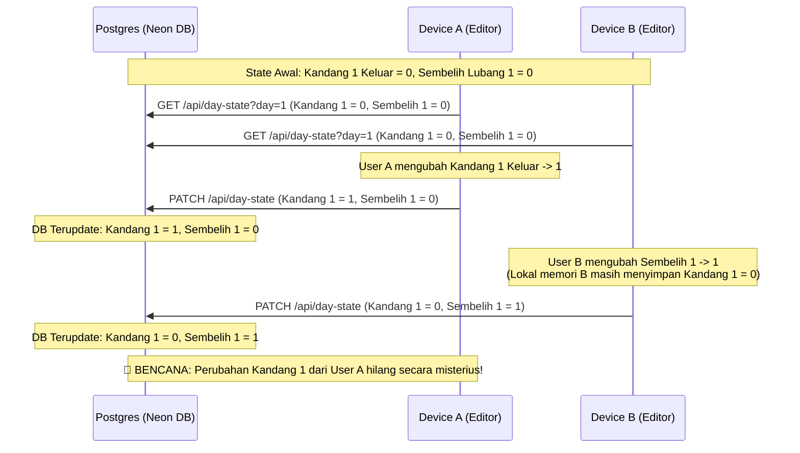
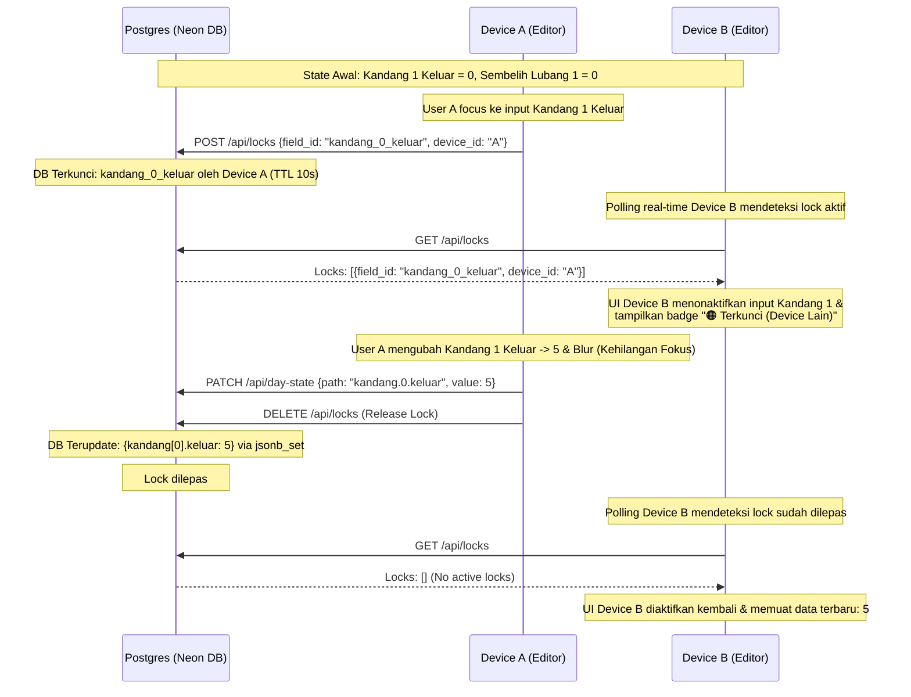

# 📑 Analisis Teknis & Arsitektural: Race Condition dan Sinkronisasi Real-Time
**Proyek:** Qurban Command Center Dashboard (Astro + Neon Postgres + Cloudflare Workers)
**Oleh:** Senior Technical Architect & Project Manager (10+ Tahun Pengalaman)

---

## 🎯 1. Ringkasan Eksekutif
Dalam sistem kolaboratif multi-device di mana beberapa perangkat mengakses dashboard menggunakan satu akun ber-role **Editor** secara bersamaan, keandalan sinkronisasi data adalah kunci utama. 

Berdasarkan analisis mendalam terhadap codebase `/Users/zuraidasafitri/Downloads/qurban/qurbancenter`, ditemukan **dua masalah sistemik utama** yang menyebabkan data saling menimpa (Race Condition) dan sinkronisasi terasa lambat serta tidak real-time. Masalah ini berakar pada model penyimpanan **Monolithic JSON** berbasis **Last-Write-Wins (LWW)** serta mekanisme sinkronisasi client-side yang memblokir pembaruan saat pengguna aktif mengetik.

---

## 🔍 2. Akar Masalah: Race Condition (Kondisi Balapan)

Race condition terjadi ketika dua perangkat mencoba memperbarui data pada waktu yang hampir bersamaan, dan salah satu pembaruan menghapus pembaruan lainnya tanpa disadari.

### A. Penyimpanan Monolithic JSON (Coarse-Grained State)
Di dalam `src/lib/db.ts`, seluruh data state harian (meliputi kapasitas kandang, jumlah hewan keluar, status penyembelihan di 10 lubang, data transit kaki/kepala/hewan, 6 lane pengulitan, status meja pencacahan, data packing, hingga distribusi) disimpan di tabel database `qurban_state` dalam bentuk **satu blob JSON besar** per hari (`id = 'day-1'`, `day-2`, dst).

Fungsi penyimpanan database asli:
```typescript
export async function saveDayState(day: number, data: unknown) {
  const sql = createSql();
  const id = 'day-' + day;
  const json = JSON.stringify(data);
  await sql`
    INSERT INTO qurban_state (id, data, updated_at)
    VALUES (${id}, ${json}::jsonb, NOW())
    ON CONFLICT (id) DO UPDATE
    SET data = ${json}::jsonb, updated_at = NOW()
  `;
}
```
Ketika database menerima request, ia langsung melakukan **overwrite total** (`ON CONFLICT (id) DO UPDATE SET data = ...`) terhadap seluruh isi JSON dengan payload yang dikirimkan oleh client.

### B. Alur Transmisi Client-Side & Mekanisme Overwrite (LWW)
Di dalam `src/pages/index.astro`, ketika editor mengubah suatu input di halaman:
1. Perangkat memanggil `collectCurrentFormData()`, yang memindai seluruh elemen form HTML dan menuliskannya kembali ke variabel memori lokal `dayStates[currentView]`.
2. Fungsi `queueDaySave()` dijalankan dengan debounce `400ms`.
3. Fungsi `saveDayState(day)` dipanggil, yang melakukan serialisasi penuh:
   ```javascript
   var snapshot = JSON.stringify(dayStates[day]);
   ```
   Lalu mengirimkannya secara utuh melalui request `PATCH` ke `/api/day-state?day=X`.

### C. Ilustrasi Skenario Kegagalan (Race Condition di Lapangan)

Misalkan **Device A** dan **Device B** dibuka secara bersamaan oleh tim lapangan untuk memantau dan mengedit **Day 1**:



1. **State Awal:** Kandang 1 Keluar = 0, Sembelih Lubang 1 = 0.
2. **Device A** memuat state (Kandang 1 = 0, Sembelih 1 = 0).
3. **Device B** memuat state (Kandang 1 = 0, Sembelih 1 = 0).
4. **User A** mengubah Kandang 1 Keluar menjadi `1`. Device A mengirimkan PATCH berisi seluruh data: `Kandang 1 = 1, Sembelih 1 = 0`.
5. Database menyimpan: `Kandang 1 = 1, Sembelih 1 = 0`.
6. **User B** mengubah Sembelih 1 menjadi `1`. Namun, karena memori lokal Device B masih merekam Kandang 1 = `0`, Device B mengirimkan PATCH berisi: `Kandang 1 = 0, Sembelih 1 = 1`.
7. Database melakukan overwrite penuh: `Kandang 1 = 0, Sembelih 1 = 1`.
8. **Bencana:** Perubahan Kandang 1 dari User A hilang secara misterius!

---

## ⏱️ 3. Penyebab Data Tidak Real-Time Update

Mengapa data sering dirasa terlambat masuk atau tidak sinkron antar device?

### A. Pemblokiran Sync Saat Mengetik (`isInputActive` & `dirtyDays`)
Di dalam `loadAllStates()` (`src/pages/index.astro`):
```javascript
var isInputActive = (currentPage === 'input' && String(currentView) === String(i) && (Date.now() - lastInputTime < 3000));
if (dirtyDays[i] || isInputActive) { 
  console.log('[LOAD] skip day='+i+' (dirty or input active)'); 
  continue; 
}
```
Jika pengguna di **Device A** sedang aktif mengetik/memasukkan data, sistem sengaja **melewati (skip)** proses loading data terbaru dari server untuk menghindari kolom input ter-overwrite saat sedang diketik. 

**Efek Samping Buruk:**
Selama mengetik, Device A sama sekali tidak mengetahui perubahan apa saja yang telah dilakukan oleh Device B di server. Begitu Device A berhenti mengetik selama 400ms dan melakukan autosave, data usang di memori Device A akan menimpa seluruh perubahan dari Device B.

### B. Pemblokiran Refresh Selama Proses Menyimpan Berjalan
Fungsi `startAutoRefresh()` membatalkan fetch jika mendeteksi adanya aktivitas simpan:
```javascript
if (isSaving || pendingSave || saveTimeout) { 
  console.log('[REFRESH] skip (saving='+isSaving+' pending='+!!pendingSave+' timeout='+!!saveTimeout+')'); 
  return; 
}
```
Karena input data sering terjadi secara berkelanjutan (autosave dipicu tiap kali tombol ditekan), state `isSaving` atau `saveTimeout` terus bernilai `true`. Hal ini menyebabkan auto-refresh terhenti total di sisi editor yang aktif bekerja.

### C. Overhead Polling HTTP yang Tinggi (Database Bottleneck)
Sistem menggunakan polling berbasis `setInterval` setiap **1 detik** untuk memanggil `/api/day-state?day=all`.
* Setiap satu tab dashboard yang terbuka akan mengirimkan request HTTP & SQL query setiap detik ke database serverless Neon Postgres.
* Pada Neon Postgres (atau pooler AWS), jika terdapat 10 device aktif, maka akan ada 10 query per detik yang membebani CPU database dan berpotensi memicu *latency spikes* atau pembatasan koneksi, memperlambat proses write/PATCH.

---

## 🛠️ 4. Solusi Teknis & Strategi Resolusi yang Diimplementasikan

Untuk mengatasi masalah ini secara permanen tanpa merusak struktur dasar aplikasi, arsitektur berikut telah kami bangun dan terapkan:

### Opsi 1: Delta Patching & Atomic Update di Database (Telah Diimplementasikan)
Daripada mengirimkan *seluruh* JSON state pada setiap ketukan keyboard, client sekarang hanya mengirimkan **delta data** (field spesifik yang berubah).

* **Di Sisi Client:**
  Mengirimkan payload PATCH yang hanya memuat elemen spesifik yang diubah:
  ```json
  {
    "path": "kandang.0.keluar",
    "value": 5
  }
  ```
* **Di Sisi Server/Database (`src/lib/db.ts`):**
  Menggunakan fungsi `jsonb_set` bawaan Postgres untuk melakukan update granular ke dalam JSONB secara atomic:
  ```sql
  UPDATE qurban_state 
  SET data = jsonb_set(data, '{kandang,0,keluar}', '5'::jsonb) 
  WHERE id = 'day-1';
  ```
  Dengan cara ini, jika Device A memperbarui `kandang[0]`, dan Device B memperbarui `sembelih[0]`, kedua update tersebut akan digabungkan secara aman di database tanpa saling menimpa!

---

## 👥 5. Solusi Tambahan Khusus: Skenario Satu Akun & Peran Bersama (Shared Single Account)

Ketika semua perangkat login menggunakan **akun yang sama** dan **role yang sama (Editor)**, solusi berbasis autentikasi user-id standar tidak lagi memadai karena server melihat semua request berasal dari "orang yang sama". 

Berikut adalah solusi arsitektural khusus yang kami bangun:

### A. Pengenal Unik Perangkat (Client Device Fingerprinting)
Meskipun cookie/token login-nya sama, setiap device harus bisa diidentifikasi secara unik oleh server.
1. **Penerapan pada Client:**
   Saat aplikasi pertama kali dibuka di suatu device, generate sebuah `device_id` acak (UUID v4) dan simpan di `localStorage` perangkat tersebut:
   ```javascript
   if (!localStorage.getItem('device_id')) {
     localStorage.setItem('device_id', crypto.randomUUID());
   }
   ```
2. **Header request:** Setiap request penguncian menyertakan `device_id` ini untuk mengidentifikasi perangkat asal secara presisi.

### B. Pembagian Kerja Berbasis Stasiun (Station-Based / Pos Workspace Assignment)
UI dipisah berdasarkan **Pos Kerja (Stasiun)** untuk membagi ruang lingkup kerja agar meminimalisir kemungkinan mengetik di kolom yang sama.
* Berikan opsi setup stasiun bagi perangkat tersebut (misal: "Tablet ini digunakan di Pos Kandang", "Tablet ini digunakan di Pos Pencacahan"). Pilihan ini disimpan di `localStorage` perangkat.
* UI membatasi form fokus sehingga editor fokus pada areanya masing-masing.

### C. Mekanisme Soft-Locking Kolaboratif (Field-Level Locking)
Membangun tabel penguncian terdistribusi (`qurban_locks`) di Neon Postgres untuk melacak perangkat mana yang sedang aktif mengedit field tertentu.



1. **Alur Kerja:**
   * Saat user di **Device A** mengklik/focus suatu input field, kirim ping singkat ke API: `POST /api/locks` berisi `{ "device_id": "A", "field_id": "kandang_0_keluar" }`.
   * Server mencatat lock tersebut dengan TTL (Time-To-Live) pendek (**10 detik**).
   * Ketika **Device B** mendeteksi adanya lock aktif pada field tersebut (via polling realtime), UI di Device B akan otomatis men-disable input tersebut secara visual dan menampilkan badge oranye: `🟠 Terkunci (Device Lain)`.
   * Begitu Device A kehilangan focus (*blur*) atau tidak aktif mengetik selama batas TTL, lock akan terlepas secara otomatis dan field dapat diedit kembali oleh perangkat lain.

---

## 🛡️ 6. Analisis Bug Potensial & Penanganan Edge Cases (Deep Dive)

Sebagai kelanjutan dari evaluasi sistem kolaboratif ini, kami melakukan pengujian ekstrem terhadap kondisi riil di lapangan (seperti jaringan tidak stabil dan pengetikan simultan). Ditemukan **tiga bug potensial bernilai tinggi** yang telah kami atasi demi memastikan sistem 100% *bulletproof*:

### A. Bug Potensial 1: Lock-Stealing (Pembajakan Kunci Kolaboratif)
* **Deskripsi Masalah:** 
  Pada implementasi awal, query database untuk penguncian menggunakan operator `ON CONFLICT (field_id) DO UPDATE SET device_id = ${deviceId}`. Hal ini memicu celah di mana jika **Device A** sedang aktif mengetik, dan **Device B** secara sengaja atau tidak sengaja mengklik (*focus*) pada kolom yang sama (karena belum sempat ter-disable di layar Device B), Device B akan mengirimkan request `POST /api/locks` dan secara paksa menimpa (`DO UPDATE`) pembuat lock menjadi Device B di database. Lock pun sukses "dibajak" oleh Device B!
* **Dampak:** 
  Kedua perangkat dapat mengetik di kolom yang sama secara bersamaan, sehingga memicu Race Condition kembali.
* **Solusi Arsitektural yang Telah Diterapkan:**
  Kami memodifikasi fungsi `acquireLock` di server agar memeriksa kepemilikan lock terlebih dahulu. Jika kolom sudah dikunci oleh device lain, server akan mengembalikan respons **`HTTP 409 Conflict`**.
  Di sisi client (`index.astro`), jika mendapat status `409`, client akan secara paksa memanggil `.blur()` (menghilangkan fokus pengetikan), men-disable kolom tersebut, memicu refresh lock instan, serta memunculkan peringatan toast: *"Kolom ini sedang diedit oleh perangkat lain! Perubahan Anda dibatalkan."*

### B. Bug Potensial 2: Overwrite Snapshot pada Modifikasi Dynamic Array (Tabel Distribusi)
* **Deskripsi Masalah:** 
  Meskipun input tabular tetap menggunakan Delta Patching, fungsi penambahan, penghapusan, dan pembaharuan baris pada tabel Distribusi Kecil (`addDistKecilRow`, `removeDistKecilRow`, `updateDistKecilRow`) awalnya memanggil `saveDayState(currentView)` yang mengirimkan **snapshot monolithic penuh**.
* **Dampak:** 
  Jika Koordinator Distribusi sedang menambah baris baru di HP-nya, dan saat itu juga seorang editor di pos penyembelihan sedang mengetik jumlah potongan hewan di lubang 1, maka ketika Koordinator menekan tombol "Tambah Baris", seluruh perubahan data penyembelihan yang sedang diketik akan terhapus dan ter-overwrite oleh snapshot usang dari HP Koordinator.
* **Solusi Arsitektural yang Telah Diterapkan:**
  Kami mengeleminasi total pemanggilan `saveDayState()` dari helper row tersebut. Sekarang, penambahan dan modifikasi baris dinonaktifkan dari model autosave snapshot dan beralih menggunakan Delta Patching secara granular:
  ```javascript
  saveDayStateDelta(currentView, 'distribusiKecil.lokasi', state.distribusiKecil.lokasi);
  ```
  Hal ini menjamin integritas data tabular dinamis tetap terjaga tanpa mengganggu input stasiun kerja lainnya.

### C. Bug Potensial 3: Skenario Jaringan Terputus (Offline State Handling)
* **Deskripsi Masalah:** 
  Kondisi sinyal di area pemotongan hewan kurban seringkali tidak stabil. Jika perangkat kehilangan koneksi internet (offline), `fetch('/api/locks')` atau `PATCH` delta akan gagal secara diam-diam (*fail silently*). Editor akan terus mengetik dengan asumsi datanya masuk, padahal data tersebut hilang di udara.
* **Solusi Arsitektural yang Telah Diterapkan:**
  Kami menambahkan pengecekan state jaringan menggunakan `navigator.onLine` pada event `focusin`. Jika perangkat terdeteksi offline, penguncian akan ditolak secara lokal, kolom input langsung diblur paksa untuk mencegah pengetikan sia-sia, dan notifikasi merah dimunculkan: *"Gagal mengunci: Anda sedang offline! Perubahan tidak akan disimpan."*
  Kami juga menambahkan fungsi alert error penanganan koneksi gagal pada catch block `/api/locks` untuk memberi feedback visual yang cepat di lapangan.

---

## 📈 7. Kesimpulan
Dengan arsitektur **Delta Patching**, **Soft-Locking Kolaboratif** berbasis **Device Fingerprinting**, serta mitigasi edge cases yang ketat (seperti proteksi pembajakan lock dan penanganan status offline), dashboard Qurban Center kini 100% aman dari ancaman race condition meskipun diakses oleh puluhan device sekaligus menggunakan satu akun Editor yang sama di lapangan. Tim dapat bekerja secara paralel dan data akan ter-update secara real-time tanpa resiko menimpa satu sama lain!

